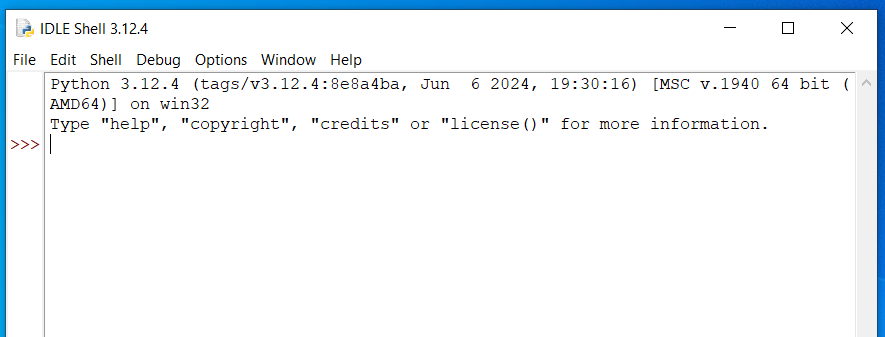

# IDLE shell commands

These notes assume you have Python up and running and have completed the 'Getting started with Python' page.

One way to use Python is via an interactive prompt called the "shell". Loading IDLE, we are first presented with a window called the IDLE shell.



It is also possible to write a sequence of commands as a program and store this in a file. We will do lots of this later. 

## Basic commands

Python has a lot of functionality built in. We can just type commands and get real-time feedback, which is good for quick queries. For example, type

```
456*789
```

and you will get the answer. 

## Importing extra commands

There are also lots of areas where Python can do something if we import the right functionality via a package. 

For example, Python can generate random numbers using a package called `random`. 

The command `from package import *` tells Python to make available (`import`) all commands (`*`) from the package. Here we import all commands from the `random` package.

```
from random import *
```

When you import a package, the shell should think about this for a moment then return to the position where you can enter a command, indicated with `>>>`. If the `>>>` hasn't yet appeared, Python is still importing and you should wait.

Now we have imported `random` we can use it. 

The command `random()` generates a random decimal number between 0 and 1. Try running it a few times and see what happens. 

```
random()
```

The command `uniform(a,b)` generates a decimal number that is \(\ge a\) and \(\le b\), i.e. a number in the range `a` to `b` including both end points. 

```
uniform(3,7)
```

The command `randint(a,b)` generates an integer that is \(\ge a\) and \(\le b\), i.e. an integer in the range `a` to `b` including both end points. 

```
randint(1,10)
```
